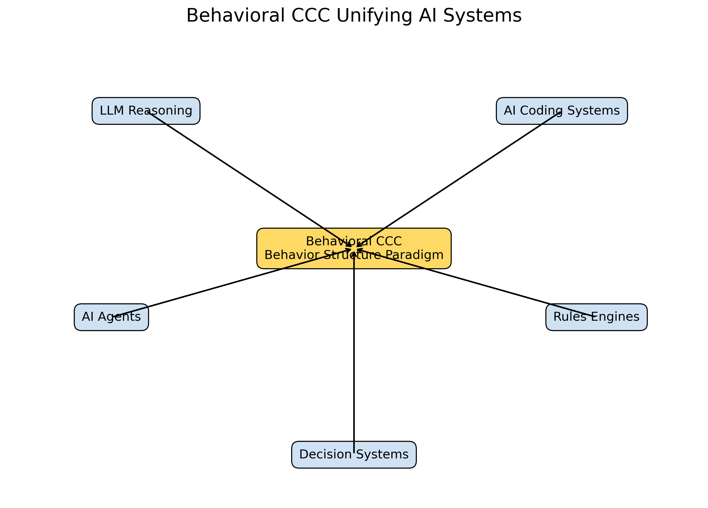

# Behavioral CCC

## A Behavioral Structure Paradigm for Intelligent Systems

### Intelligence is the ability to select effective behavioral trajectories  
### under goals and constraints.

Rules are constraints on behavioral trajectories.

---

Behavioral CCC introduces a structural paradigm for modeling behavior  
and decision trajectories in intelligent systems.

---

---

## Overview

Behavioral CCC (Behavioral Common Concept Core) proposes a structural paradigm
for understanding intelligent behavior.

Modern AI systems appear diverse — including large language model reasoning,
AI coding assistants, autonomous agents, rule engines, and decision systems.
However, these systems share a common structural pattern:

**the selection of behavioral trajectories under goals and constraints.**

Behavioral CCC models this shared structure.

The paradigm extends Structural Intelligence from **static knowledge structures**
to **behavior structures**, enabling a unified interpretation of intelligent systems.

---

## Key Insight

> Intelligence is behavioral trajectory selection.  
> Rules are constraints on behavioral trajectories.

---

## Structural Intelligence Stack

Behavioral CCC builds on earlier Structural Intelligence concepts:

    Metric Distance
    ↓
    Differential Tree
    ↓
    Static CCC
    ↓
    Behavioral CCC
    ↓
    Intelligent Runtime Systems
    

This stack connects **structural knowledge modeling** with **behavioral decision systems**.

---

## AI Systems Interpreted by Behavioral CCC

The Behavioral CCC paradigm provides a unified interpretation of:

- LLM reasoning systems  
- AI coding assistants  
- AI agents and tool-based systems  
- rule engines and policy systems  
- workflow and decision architectures  

Rather than treating these systems as unrelated mechanisms,
Behavioral CCC interprets them as instances of

**behavioral path selection within constrained decision spaces.**

---

## Repository Structure

    docs/
    01-behavioral-ccc-introduction
    02-structural-vs-behavioral-ccc
    03-llm-behavioral-ccc
    04-ai-coding-behavioral-ccc
    05-rules-engines-unification
    06-runtime-architecture
    
    diagrams/
    behavioral-ccc-paradigm-map
    static-vs-behavioral-ccc
    behavioral-ccc-unifying-ai-systems
    
    poster/
    behavioral-ccc-paradigm-poster
    

---

## Citation

If you use ideas from this project, please cite the repository.

See:

    HOW-TO-CITE.md

---

## Authors

Sizhe Tan  
ChatGPT (OpenAI)

---

## Repository

https://github.com/sizhet/Behavioral-Structure-Paradigm-for-Intelligent-Systems

## Additional Readings About DBM-SI and CCC

https://github.com/sizhet/Hyperlanguage-Large-Models-HLM

https://github.com/sizhet/Structural-Intelligence-Ontology-SIO

https://github.com/sizhet/Digital-Brain-Model-Chain-of-Thoughts

https://github.com/sizhet/DBM-SI-Structural-Messaging

## Citation

If you use or reference this work, please cite:

    Tan, S., & ChatGPT. (2026).
    Behavioral CCC: A Behavioral Structure Paradigm for Intelligent Systems.
    https://github.com/sizhet/Behavioral-Structure-Paradigm-for-Intelligent-Systems
    DOI: TBD

## License

    Apache License 2.0  
    http://www.apache.org/licenses/LICENSE-2.0