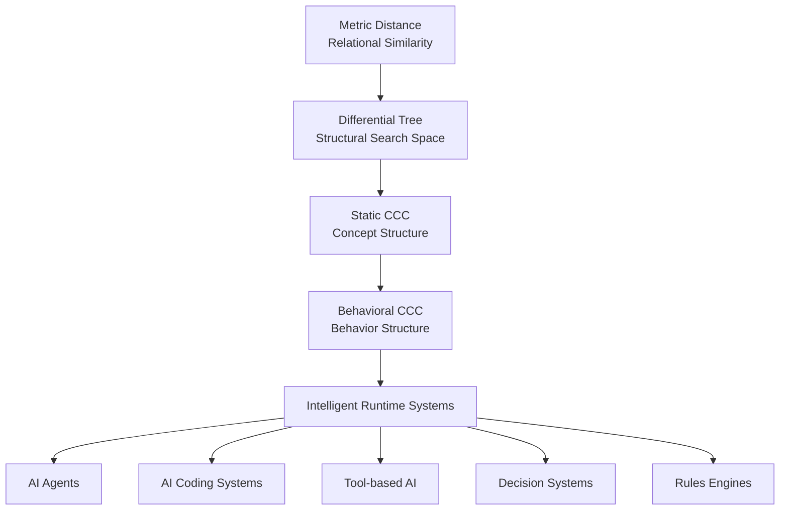
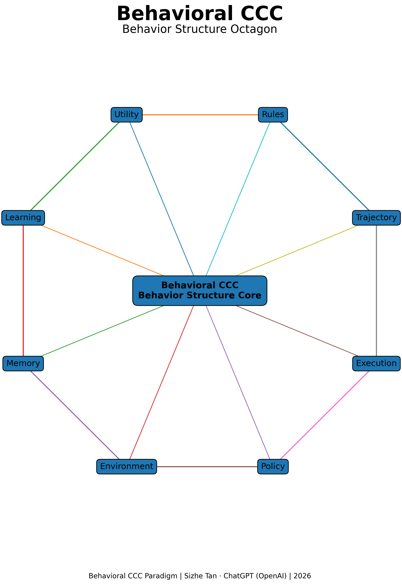

# Behavioral CCC
## A Behavioral Structure Paradigm for Intelligent Systems

Behavioral Common Concept Core (Behavioral CCC) introduces a structural paradigm for modeling behavior and decision processes in intelligent systems.

Traditional artificial intelligence systems often rely on rules, policies, or statistical models to guide decision-making. However, these approaches frequently lack a unified structural framework capable of explaining behavior across different domains.

Behavioral CCC addresses this gap by identifying the **shared structural patterns of behavioral trajectories**.

Instead of describing static similarities between objects, Behavioral CCC describes similarities between **decision paths**.

In this framework:

- **Static CCC** captures shared structures of concepts and objects.
- **Behavioral CCC** captures shared structures of behavior and decision processes.

Thus Structural Intelligence expands from static knowledge modeling into dynamic behavioral modeling.

---

## Behavioral CCC Paradigm Map

---

## Behavioral Trajectory Perspective

Intelligent behavior typically unfolds as sequences of observations and actions:

    o₁ → a₁ → o₂ → a₂ → ... → outcome
    

Where:

- `o` represents observations
- `a` represents actions

Across many instances of behavior, similar trajectories emerge.  
These repeated trajectory structures form **Behavioral CCCs**.

---

## Structural Intelligence Layers

Within the Structural Intelligence framework, Behavioral CCC represents the dynamic layer:

    Metric Distance
    ↓
    Differential Tree
    ↓
    Static CCC
    ↓
    Behavioral CCC
    

Where:

- Metric Distance models relational similarity
- Differential Tree organizes structural search
- Static CCC captures conceptual structures
- Behavioral CCC models decision trajectories

Behavioral CCC therefore connects structural knowledge to intelligent behavior.

---

## Core Idea

Behavioral CCC allows intelligent systems to reason about **behavior structures**, not only about object structures.

This paradigm provides a foundation for understanding decision-making across:

- AI agents
- tool-based systems
- coding assistants
- rule-based decision systems

---

---
