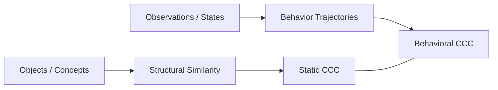

# Structural CCC vs Behavioral CCC

Structural Intelligence distinguishes two complementary types of Common Concept Cores (CCC):

- Static CCC
- Behavioral CCC

These two layers correspond to structural and dynamic aspects of intelligence.

---

## Static CCC vs Behavioral CCC

---

## Static CCC

Static CCC describes shared structural properties between objects or concepts.

Examples include:

- geometric similarity
- category structures
- attribute clustering
- conceptual abstraction

Static CCC focuses on answering the question:

> What is this object or concept?

---

## Behavioral CCC

Behavioral CCC focuses on the structure of **decision trajectories**.

It answers a different question:

> How does the system behave under given goals and constraints?

Behavioral CCC identifies patterns in sequences such as:
